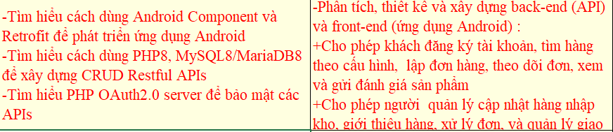
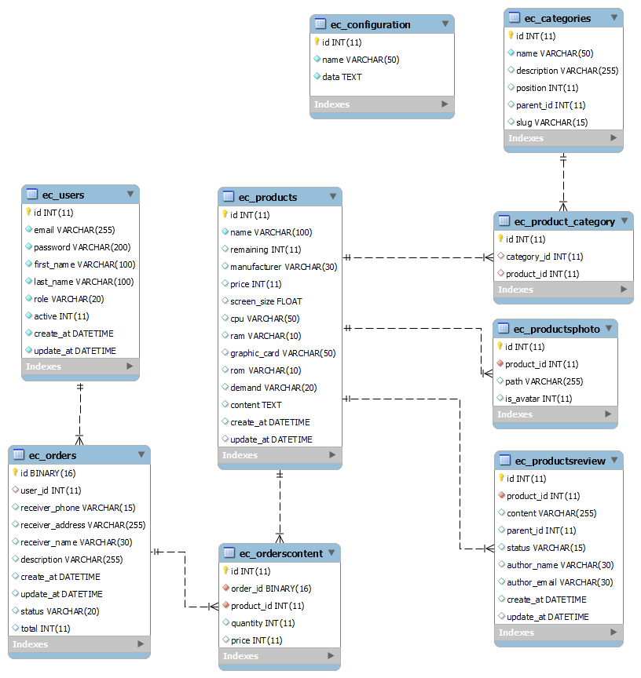
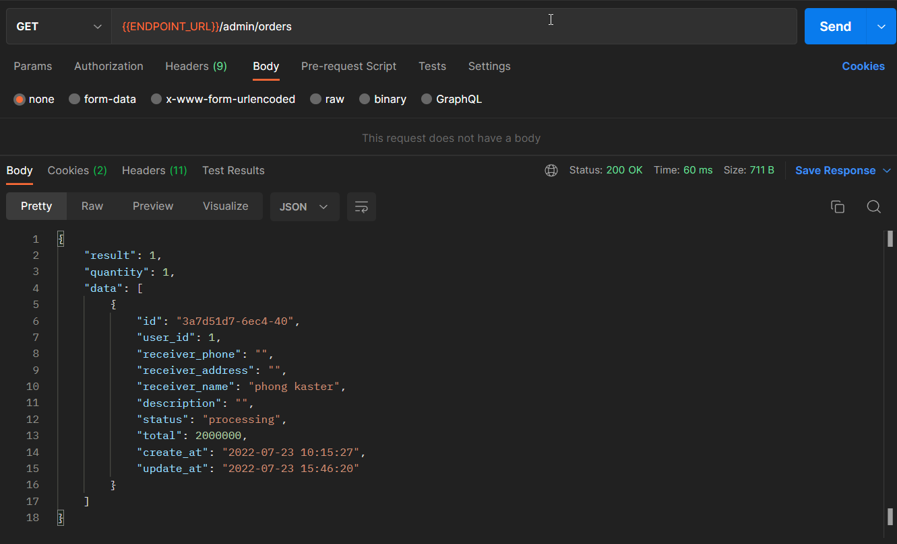
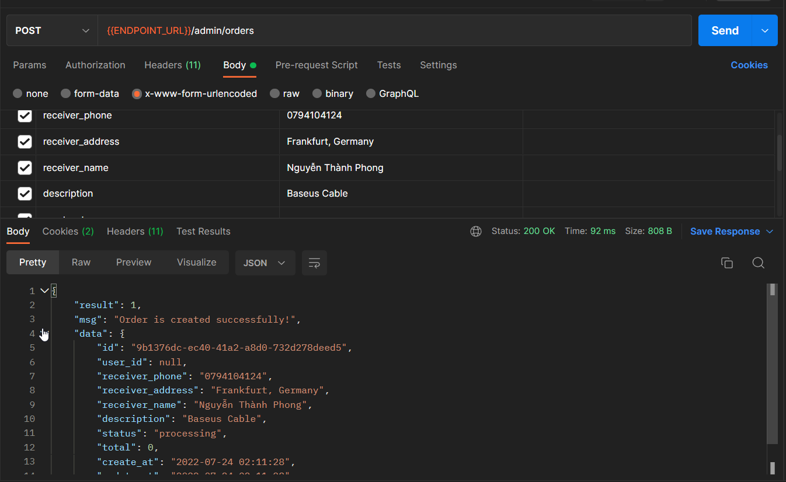
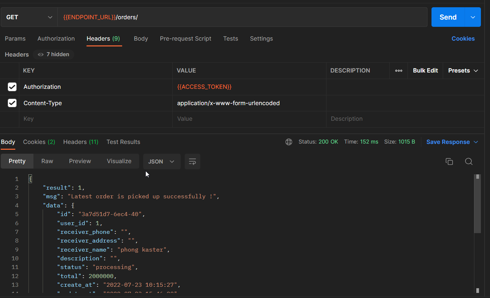

<h1 align="center">Đồ Án Thực Tập 
    Đề tài: ứng dụng mua bán máy tính/Laptop
</h1>

    

# [**Table Of Content**](#table-of-content)
- [**Table Of Content**](#table-of-content)
- [**Topic**](#topic)
- [**Database**](#database)
- [**Important Modules**](#important-modules)
  - [**1. Admin Order Controller**](#1-admin-order-controller)
    - [**1.1. Get Order By Id**](#11-get-order-by-id)
    - [**1.2 - Modify Order**](#12---modify-order)
    - [**1.3. Delete**](#13-delete)
  - [**2. Admin Orders Controller**](#2-admin-orders-controller)
    - [**2.1. Get All**](#21-get-all)
    - [**2.2. Save**](#22-save)
  - [**3. Orders Controller**](#3-orders-controller)
    - [**3.1. Get Latest Order**](#31-get-latest-order)
    - [**3.2. Modify Order**](#32-modify-order)
    - [**3.3. Confirm Order**](#33-confirm-order)
- [**Mentor**](#mentor)
  - [**1. Nguyễn Thị Bích Nguyên**](#1-nguyễn-thị-bích-nguyên)
  - [**2. Nguyễn Anh Hào**](#2-nguyễn-anh-hào)
  - [**3. Lê Hồng Sơn**](#3-lê-hồng-sơn)
  - [**4. Phan Thanh Hy**](#4-phan-thanh-hy)
  - [**6. Lưu Nguyễn Kì Thư**](#6-lưu-nguyễn-kì-thư)
- [**Controller Timeline**](#controller-timeline)
- [**Timeline**](#timeline)
  - [**Phase 1: 29-06-2022 to 10-07-2022**](#phase-1-29-06-2022-to-10-07-2022)
  - [**Phase 2: 10-07-2022 to 13-07-2022**](#phase-2-10-07-2022-to-13-07-2022)
  - [**Phase 3: 14-07-2022 to xx-xx-2022**](#phase-3-14-07-2022-to-xx-xx-2022)
- [**Post Script**](#post-script)
- [**Special Thank**](#special-thank)
- [**Made with 💘 and PHP **](#made-with--and-php-)

# [**Topic**](#topic)

    

<h3 align="center">

***Đề tài thực tập do thầy Nguyễn Anh Hào soạn***
</h3>

# [**Database**](#database)

    

<h3 align="center">

***Bản thiết kế tiêu chuẩn cơ sở dữ liệu cho đồ án thực tập***
</h3>

# [**Important Modules**](#important-modules)

Có 2 controller quan trọng mà có giá trị cao nhất trong đồ án này. Đó là phần xử lý giỏ hàng. 
Xử lý giỏ hàng có lẽ sẽ là phần củ khoai nhất trong đề tài thương mại điện tử.

Hãy chú ý coi qua các controller sau đây: 

## [**1. Admin Order Controller**](#1-admin-order-controller)

Controller này có những chức năng chính như sau: tìm giỏ hàng theo Id, thay đổi nội dung của giỏ hàng & xóa giỏ món hàng trong giỏ hàng

### [**1.1. Get Order By Id**](#11-get-order-by-id)

Tìm kiếm theo Id - chức năng như tên gọi, truyền một ID vào thì sẽ tìm ra giỏ hàng và các món hàng trong giỏ hàng đó. 

### [**1.2 - Modify Order**](#12---modify-order-thay-đổi-nội-dung-giỏ-hàng) 

Tức là thay đổi nội dung giỏ hàng

**Bước 1** - Cần truyền cho controller này: OrderId, Receiver_phone, receiver_address & receiver_phone. Đây sẽ là những trường dữ liệu bắt buộc phải có. 

**Bước 2** - Giỏ hàng chỉ có thể được thay đổi tùy thích trừ khi trạng thái của nó là một trong hai trạng thái sau: delivered & cancel.

**Bước 3**

- Trường hợp 1 - Khi trạng thái giỏ đang là **processing** => **['verified', 'packed', 'being transported', 'delivered' ]** thì số lượng tồn của các sản phẩm sẽ giảm đi tương ứng 
với số lượng có trong giỏ hàng. Tương đương việc người dùng cho sản phẩm vào giỏ hàng và nhấn **Xác nhận** sẽ mua những món hàng này

Ví dụ: Mình mua 3 sản phẩm A và 1 sản phẩm B thì số lượng tồn của nó sẽ bị trừ đi lần lượt là 3 và 2.

Trường hợp mua hàng nhưng có sản phẩm không đủ số lượng thì chương trình sẽ xuất ra thông báo.

> Oops ! Sản phẩm Laptop MSI, Laptop MSi 14 đã hết hàng

- Trường hợp 2 - Khi trạng thái giỏ đang là **["verified", "packed", "being transported"]** => **cancel** thì số lượng 
sản phẩm sẽ được hoàn trả về như cũ. Tức người dùng lựa chọn **Hủy đơn**

Ví dụ: Mình mua 2 sản phẩm A và 2 sản phẩm B, nếu mình hủy giỏ hàng thì số lượng tồn sẽ được cộng lên 2 đơn vị mỗi món hàng.

**Bước 4** - Các quá trình xử lý trên hoàn tất thì sẽ lưu dữ liệu vào cơ sở dữ liệu

### [**1.3. Delete**](#13-delete)

**Bước 1** - Truyền vào OrderID 

**Bước 2** - Nếu giỏ hàng đang ở các trạng thái **["being transported", "deliverd", "verified"]** thì sẽ không cho xóa.

**Bước 3** - Ta chỉ xóa giỏ hàng nếu nó không ở thuộc các trạng thái bước 2 + không có bất kì món hàng trong giỏ hàng này.

**Bước 4** - Lưu các thay đổi vào cơ sở dữ liệu nếu các bước 2 và 3 không bị vi phạm.

## [**2. Admin Orders Controller**](#2-admin-orders-controller)

Controller này phụ trách 2 nhiệm vụ chính hỗ trợ cho người quản trị, gồm: 
getAll() - liệt kê các đơn hàng và save() - tạo mới đơn hàng.

### [**2.1. Get All**](#get-all)

Chức năng này như tên gọi của nó, chỉ đơn thuần liệt kê các thông tin của các đơn hàng trong cơ sở dữ liệu

    

<h3 align="center">

***Dữ liệu trả về liệt kê thông tin các giỏ hàng***
</h3>

### [**2.2. Save**](#save)
Chức năng này giúp người quản trị viên tạo giỏ hàng thay cho khách hàng nếu cần thiết.

**Bước 1** - lấy ra tất cả các dữ liệu từ phía website gửi lên, bao gồm các thông tin cơ bản. Trong số này, 
thông tin người nhận hàng là các dữ liệu bắt buộc phải có - receiver_phone, receiver_name, receiver_address. 

Trong đó, riêng mã đơn hàng(OrderId) sẽ là một UUID - Universally Unique IDentifier - chuỗi có 16 kí tự để tránh trường hợp có 
tin tặc phát hiện ra mã đơn hàng tiếp theo. Dẫn tới chiếm quyền các đơn hàng sau này.

**Bước 2** - vì đây là giỏ hàng nên các thông tin về người nhận hàng cần được kiểm tra kĩ càng. Thông tin người nhận hàng 
phải thỏa mãn các yêu cầu sau: 

- Số điện thoại(receiver_phone) phải có ít nhất 10 số.

- Tên người(receiver_name) chỉ bao gồm chữ cái và các dấu trong tiếng Việt.

- Địa chỉ nhận hàng(receiver_address) chỉ bao gồm chữ cái, các dấu trong tiếng việt, khoảng trắng & dấu phẩy.

**Bước 3** - Kiểm tra trạng thái của đơn hàng có hợp lệ hay là không. Một đơn hàng sẽ có 6 trạng thái sau là hợp lệ: 

- Processing - tức đang xử lý, người dùng và quản trị viên vẫn đang mua và vẫn có thể thay đổi nội dung giỏ hàng.

- Verified - tức người dùng xác nhận mua hàng hoặc người quản trị viên xác nhận giúp người dùng qua điện thoại rằng họ sẽ mua hàng. 

- Packed - tức đơn hàng đã đóng gói.

- Being transported - tức đơn hàng đang vận chuyển

- Delivered - tức đơn hàng đã vận chuyển thành công tới người dùng.

- Cancel - tức đơn hàng bị hủy bởi người dùng hoặc quản trị viên

**Bước 4** - nếu các bước xử lý ở bên trên là hợp lệ thì tiến hành tạo mới đơn hàng.

    

<h3 align="center">

***Dữ liệu trả về nếu giỏ hàng được tạo thành công***
</h3>

## [**3. Orders Controller**](#3-orders-controller)

Đây là chức năng xử lý giỏ hàng cho phía khách hàng. Có 3 hàm chính trong Controller này bao gồm 

1. Get Latest Order - lấy ra giỏ hàng gần nhất của người dùng mà trạng thái là Processing.

2. Modify Order - cập nhật lại các món hàng trong giỏ hàng của người dùng 

3. Confirm Order - xử lý khi người dùng ấn nút **XÁC NHẬN** mua hàng. Chức năng này liên quan đến xử lý 
số lượng hàng tồn kho hay nói cách khác là xử lý tranh chấp.

### [**3.1. Get Latest Order**](#31-get-latest-order)

Lấy ra giỏ hàng gần nhất của người dùng mà trạng thái là processing. Nếu có giỏ hàng tồn tại thì tiếp tục cho người 
dùng chỉnh sửa nội dung các món hàng trong giỏ hàng này.

    

<h3 align="center">

***Giỏ hàng được tạo mới thì msg là Latest order is picked up successfully***
</h3>

Nếu không có giỏ hàng nào tồn tại thì tạo mới cho người dùng.

    

<h3 align="center">

***Giỏ hàng được tạo mới thì msg là Order is created successfully***
</h3>

### [**3.2. Modify Order**](#32-modify-order)

Chức này này cập nhật lại các món hàng trong giỏ hàng của người dùng.

Luồng xử lý chính sẽ như sau:

**Bước nhận và kiểm thử** - kiểm tra tính đúng sai của dữ liệu nhận vào. Ví dụ: có đơn hàng nào với mã đơn nhận được không ? Có món hàng nào với ID đó hay không ?

**Bước xử lý** - sẽ có 3 trường hợp xảy ra khi chỉnh sửa một đơn hàng như sau 

- Có món hàng(product_id) trong giỏ hàng nhưng người dùng cập nhật số lượng của nó về 0 => xóa món hàng này khỏi giỏ hàng.

- Có món hàng(product_id) trong giỏ hàng nhưng số lượng bị thay đổi và số lượng này khác 0 => tiến hành cập nhật lại.

- Không có món hàng(product_id) trong giỏ hàng => tiến hành tạo mới một order content với product_id và order_id đó.

### [**3.3. Confirm Order**](#33-confirm-order)

Chức năng này sinh ra để xử lý tranh chấp khi người dùng xác nhận mua món hàng. Có thể hiểu đơn giản như sau, khi người dùng chọn 3 món hàng 
A, B và C cho vào giỏ hàng. Số lượng họ chọn mua các mặt hàng là không bị giới hạn.

Tuy nhiên, khi họ quyết định mua và nhấn **XÁC NHẬN** mua hàng. Hệ thống sẽ tiến hành kiểm tra số lượng tồn với số lượng họ mua. Điều này sẽ dẫn tới 4 kết quả 
như sau:

**Trường hợp 1** - số lượng tồn của món hàng(product_id) lớn hơn số lượng người dùng mua thì tiến hành trừ đi số lượng tương ứng. Ví dụ: số lượng 
tồn là 10, người dùng mua 2 thì số lượng tồn còn lại là 8.

**Trường hợp 2** - số lượng tồn của món hàng(product_id) nhỏ hơn số lượng người dùng mua thì lúc này sẽ xuất ra thông báo để người dùng biết và thay đổi 

**Trường hợp 3** - người dùng mua 3 món hàng thì A có số lượng tồn đáp ứng nhưng số lượng tồn của B và C thì đã hết => Xuất ra thông báo rằng B và C đã hết hàng và dừng lại luôn

**Trường hợp 4** - người dùng đã **XÁC NHẬN** mua hàng nhưng sau đó thay đổi suy nghĩ và chọn **HỦY ĐƠN HÀNG** thì số lượng tồn của các món hàng sẽ được hoàn trả lại. 
Ví dụ: người dùng mua món hàng A với số lượng 2 món và sau đó nhấn hủy đơn thì số lượng tồn của món hàng A sẽ tăng lên 2 đơn vị.

# [**Mentor**](#mentor)

Vài dòng mình để đây không có chủ đích xúc phạm giáo viên nào nhưng mình bức xúc quá nên đánh phá luận vậy

## [**1. Nguyễn Thị Bích Nguyên**](#nguyen-thi-bich-nguyen)

Nói thẳng luôn nhé ! Bạn nào mà trúng cô hướng dẫn làm đồ án thì cứ phải gọi là đen vãi cả l*n. Vì mình là người bị phân trúng vào cô Nguyên nên mình cực khó chịu vì lý do sau: Thông thường, 
một giáo viên hướng dẫn sẽ chủ động liên hệ với bạn để giao đề tài tốt nghiệp và chỉnh sửa thông tin các kiểu.
Nhưng cô Nguyên thì lại ở cái thể loại hãm l*l hơn, cô éo bao giờ chủ động liên lạc với các bạn đâu nhé.

Nói chung là nằm mơ cũng chưa chắc 🙂☺ cô đã liên lạc với bạn. Lúc nhà trường công cố danh sách giáo viên 
hướng dẫn đồ án thực tập, mình đã muốn đổi ngay khi biết người hướng dẫn mình là cô Nguyên do từ khi
mình học năm 2 - 3, mình đã nghe các anh chị kể về cô Nguyên với một tâm trạng **ÚI GIỜI ƠI** rùi.

Và quả nhiên là đúng cmn luôn. Mình chủ động liên lạc với cô từ lúc danh sách công bố tới gần sát ngày chốt sổ để 
công bố danh sách chính thức. Liên lạc với cô qua e-mail, số điện thoại, Zalo, Facebook,.... (nói chung là hết
tất cả các phương thức mà các bạn có thể nghĩ ra 😫). Gỉa sử, số phone nhà trường cung cấp trong e-mail tới sinh
viên chẳng hạn, gọi 10 cuộc thì cả 10 cuộc toàn... thuê bao.

Một điều hãi hùng nữa là cô Nguyên có đam mê họp lúc 1-2h sáng. Trong khi thời điểm này, các bạn sinh viên 
đi thực tập về đã mỏi mệt lắm rùi + cố gắng làm đồ án thực tập nữa. Theo mình nghe ngóng thì hầu 
như họp với cô xong chả giải quyết vấn đề gì, chỉ có sự áp lực từ việc bị chửi mắng là tăng lên rõ rệt 😡😡.

## [**2. Nguyễn Anh Hào**](#nguyen-anh-hao)

Người thầy chọn mặt gửi vàng của Phong.

Do trúng cô Nguyên nên thực sự là mình không muốn đề người hướng dẫn là cô Nguyên. Qua sự tư vấn từ bạn `Huỳnh Phước Sang` nên mình quyết tâm liên 
lạc với thầy để nhận được sự giúp đỡ từ thầy.

Thật may mắn là sự nỗ lực đã được đền đáp xứng đáng. Thầy Hào cho đã chấp nhận sẽ hướng dẫn cho mình và đồng ý với đề tài mà mình tự 
chọn tại nơi thực tập thay vì phải làm đề tài của thầy soạn.

Từ lúc nhận đề tài(ngày 29-06-2022) tới khi viết những dòng lưu bút này(10-07-2022) thầy vẫn chưa có hồi âm gì về hướng dẫn cả. Có lẽ do thầy bận hoặc 
thầy muốn để sinh viên tự làm đúng hay không ? Mình cũng không biết nữa.

## [**3. Lê Hồng Sơn**](#le-hong-son)

Là giám đốc của Học viện mình. Đứng ở cương vị là người quản lý cấp cao nhất của nhà trường, ông thầy 
này ra rất nhiều yêu cầu nhưng cực kì mơ hồ, mông lung. Nếu bạn muốn làm đồ án cẩn thận thì nên né ông này luôn 

## [**4. Phan Thanh Hy**](#phan-thanh-hy)

Dĩ nhiên, mình không làm đồ án dưới sự hướng dẫn của thầy. Nhưng tiếng lành đồn xa😝😝, là `người hướng dẫn đồ án 
tào lao bí đao nhất Học viện` nên hàng năm có cực kì nhiều sinh viên liên hệ với thầy để hướng 
dẫn làm đồ án thực tập. Tại do `tào lao bí đao` quá nên thầy này chấm đồ án thực tập rất dễ. 

Mình khuyến khích bạn nào học yếu nên liên hệ trước với thầy luôn để ra trường sẽ dễ thở hơn.

## [**6. Lưu Nguyễn Kì Thư**](#luu-nguyen-ki-thu)

Giảng viên huyền thoại của trường PTIT. Người đã góp phần tạo nên bao nỗi ác mộng cho các thế hệ sinh viên Học viện. Tuy nhiên,
nếu bạn nào muốn có 1 người thấy chi tiết, hỗ trợ nhiệt tình tới tận răng thì nên chọn thầy. 

Lưu ý duy nhất là hãy suy nghĩ xem bạn học có đủ khá | giỏi không ? Vì thầy tuy chi tiết nhưng ra đề tài làm đồ án thực tập cũng tương đối phức tạp & chấm rất gắt 😨😨

# [**Controller Timeline**](#controller-timeline)

Trình tự xây dựng các controller của đồ án này, cái này các bạn tham khảo để nhận biết cái controller nào sẽ `ưu tiên xây dựng trước`.

> Note: quy ước ở cái số 3 và 4 áp dụng cho tất cả Controller nào có dạng số ít và số nhiều như `3` và `4`

> Note: các controller có tiền tố Admin ở đầu. Ví dụ: AdminProductsController, AdminCategoryController,.. là thuộc về quản trị viên. Những cái không có tiền tố ở đầu là của khách hàng

1. Login Controller

2. Sign Up Controller

3. Admin Users Controller - cái này để lấy danh sách toàn bộ user ngoại trừ chính người đang đăng nhập và thêm mới một user

4. Admin User Controller - các chức năng sửa-xóa-lấy thông tin 1 user.

5. Admin Product Controller 

6. Admin Product Controller

7. Admin Products Photos Controller - lấy ra danh sách ảnh theo ID và upload ảnh cho một sản phẩm

8. Admin Orders Controller

9. Admin Order Controller

10. Admin Orders Content Controller

11. Admin Reviews Controller

12. Products Controller 

13. Product Controller

14. Orders Controller - lấy ra giỏ hàng mới nhất chưa thanh toán & tùy biến nội dung của giỏ hàng.

15. Profile Controller - lấy ra thông tin tài khoản bằng access Token.

16. Category Controller - lấy ra các Product thuộc một danh mục

17. Categories Controller - lấy ra các danh mục và các thông tin liên quan của một danh mục

# [**Timeline**](#timeline)

## [**Phase 1: 29-06-2022 to 10-07-2022**](#phase-1-29-06-2022-to-10-07-2022)

> Ý nghĩa: Giai đoạn này phát triển API cho phía người quản trị viên.

- **29-06-2022** - khởi tạo dự án, chức năng đăng nhập và tạo mã JWT token

- **30-06-2022** - sửa lỗi JWT token do mã hóa sai, thêm Product & Products Model

- **02-07-2022** 
  
1. C.R.U.D cho bảng `Users`
2. Thêm model ProductCategories | ProductCategory | ProductsPhoto | ProductsPhotos
3. Tạo ProductsController & chức năng truy vấn dữ liệu có bộ lọc nâng cao( Không khó nhưng lâu vãi *beep* 😖)

- **03-07-2022**
1. Sửa lỗi truy vấn trong ProductsController getAll()
2. Create cho ProductsController()

- **04-07-2022**
1. R.U.D cho ProductController
2. Thêm model OrdersContent | OrdersContents Model
3. Upload ảnh cho sản phẩm
   
- **05-07-2022**
1. U.D cho sản phẩm 
2. Tinh chỉnh lại upload ảnh cho sản phẩm
3. Create cho AdminOrdersController()

- **06-07-2022**
1. C.R.U.D cho AdminOrders | Admin Order controller

- **07-07-2022**
1. Admin Orders Content Controller với đọc nội dung đơn hàng và cập nhật số lượng sản phẩm trong đơn hàng - chức năng gì 
mà loằng ngoằng quá 😴🥱. Mất mịa cả buổi tối rùi

- **09-07-2022**
1. Hoàn thiện các tính năng cập nhật, thay đổi thông tin của một đơn hàng
2. Liệt kê toàn bộ bình luận & thêm mới bình luận ở vai trò Admin

- **10-07-2022**
1. Xong toàn bộ tính năng quản lý bình luận

## [**Phase 2: 10-07-2022 to 13-07-2022**](#phase-2-10-07-2022-to-13-07-2022)

> Ý nghĩa: Giai đoạn này phát triển API cho phía người người dùng.

- **10-07-2022**
1. Products Controller - lấy danh sách sản phẩm 
2. Product Controller - chi tiết 1 sản phẩm theo ID truyền vào

- **11-07-2022**
1. Orders Controller - lấy ra giỏ hàng cho người sử dụng và thay đổi nội dung trong giỏ hàng

- **12-07-2022**
1. Tinh chỉnh lại cách xử lý giỏ hàng ở phía người dùng. Nếu không có đủ hàng sẽ không cho đơn hàng đó
tiếp tục

- **13-07-2022**
1. Tinh chỉnh lại cách xử lý giỏ hàng ở phía người quản trị. Nếu không đủ hàng sẽ không cho đơn hàng đó
tiếp tục
2. Tối ưu hóa quy trình kiểm tra dữ liệu đầu vào cho Sign Up Controller với bộ lọc cho firt_name và last_name.

## [**Phase 3: 14-07-2022 to xx-xx-2022**](#phase-3-14-07-2022-to-xx-xx-2022)

- **14-07-2022**
1. Dựng thư mục đồ án Android
2. Hoàn thành màn hình đăng nhập và hiệu ứng loading screen

- **16-07-2022**
1. Thêm Profile Controller để lấy ra thông tin người dùng
2. Màn hình intro, đăng nhập cho Android

- **17-07-2022**
1. Hoàn thiện trang chủ ứng dụng Android
2. Hoàn thiện màn hình kết quả tìm kiếm

- **18-07-2022**
1. Xong các thao tác tìm kiếm bằng SearchView và chọn theo nhu cầu ở trang chủ
2. Phác họa xong màn hình giao diện bộ lọc sản phẩm.

- **19-07-2022**
1. Xong xử lý logic cho màn hình giao diện bộ lọc sản phẩm
2. Dựng khung hình màn hình chi tiết sản phẩm

- **20-07-2022**
1. Chinh sửa lại cách trả về đường dẫn hình ảnh của getProductById()
2. Xong màn hình thông tin sản phẩm

- **21-07-2022**
1. Modal Bottom Sheet để chọn số lượng sản phẩm 
2. Lấy được API liên quan tới giỏ hàng gần nhất

- **22-07-2022**
1. Nằm đáp chăn + bật quạt
   
- **23-07-2022**
1. Xong chức năng Thêm vào giỏ hàng.
2. Dựng khung màn hình Danh mục

- **24-07-2022**
1. Hoàn thiện màn hình danh mục
2. Xóa nút trở về và giỏ hàng ở màn hình chi tiết sản phẩm

- **25-07-2022**
1. Dựng xong màn hình giỏ hàng và đổ dữ liệu vào.

- **26-07-2022**
1. Viết báo cáo thực tập cho thầy Hào - lần 1.
2. Xử lý khi người dùng cập nhật số lượng sản phẩm thì tổng số tiền cũng thay đổi theo. (Không khó mà làm lâu vãi beep)

# [**Post Script**](#post-script)

[**11h41 PM Tuesday, 05-07-2022**](#)

Cả tối mới làm được 2 chức năng ảnh cho sản phẩm. Lo quá 😥 còn phía người dùng nữa. Sợ thực sự.

[**11:58 PM Thursday, 08-07-2022**](#)

Sài gòn hôm nay mưa to quá ☔. Đi làm về muộn mệt ghê. Thêm quả chứ năng chỉnh sửa nội dung đơn hàng cồng kềnh thật sự. 

[**12:11 AM Thursday, 10-07-2022**](#)

Nửa đêm rồi, sài gòn lại mưa thật hối hả ⛈. Phần API gần xong rùi, cháy hết mình nào 🔥. Chào chiến thắng ✌

À mai thứ 6 rồi 😍😍😎😎. Sắp tới ngày cuối tuần rùi😘😍. Mong thứ 6 qua thật nhanh

[**12:49 PM Tuesday, 12-07-2022**](#)

Buồn ngủ quá 😪. Cái giỏ hàng coi vậy mà phức tạp ra phết ấy chứ bộ !. Hên là đã xong được phía người dùng rồi.
Còn phía quản trị viên chưa làm. 

[** 09:54 PM Sunday, 24-07-2022**](#)

Nay ngủ cả buổi chiều mà sao giờ đã buồn ngủ thế nhỉ ? Thui kệ tới sao thì tới.

[** 12:13 PM Tuesday, 26-07-2022 **](#)

Dựng xong màn hình giỏ hàng là thấy vui rồi 🤣🤣🤣. Phần Android đã xong được 3/4 chặng đường, chỉ còn màn hình cài đặt nữa là xong.
Thui đi ngủ mai viết báo cáo cho thầy.

# [**Special Thank**](#our-team)

<table>
        <tr>
            <td align="center">
                <a href="https://github.com/ngdanghau">
                    
                     
                    <b>Nguyễn Đăng Hậu</b>
                </a>
            </td>
            <td align="center">
                <a href="https://github.com/Phong-Kaster">
                    
                     
                    <b>Nguyễn Thành Phong</b>
                </a>
            </td>
        </tr>    
</table>
 
# [**Made with 💘 and PHP **](#made-with-love-and-php)