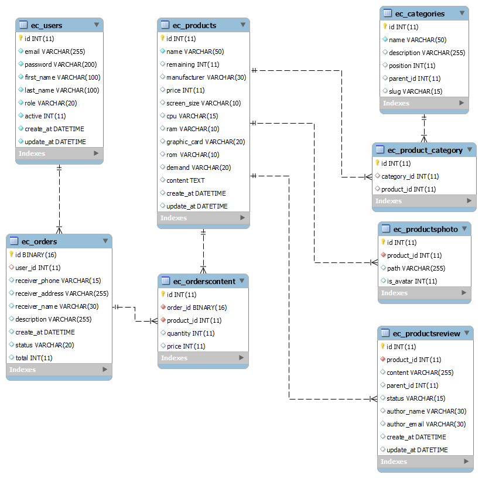

<h1 align="center">Đồ Án Thực Tập 
    Đề tài: ứng dụng mua bán máy tính/Laptop
</h1>

    

# [**Table Of Content**](#table-of-content)
- [**Table Of Content**](#table-of-content)
- [**Database**](#database)
- [**Controller Timeline**](#controller-timeline)
- [**Timeline**](#timeline)
  - [**Phase 1: 29-06-2022 to xx-xx-2022**](#phase-1-29-06-2022-to-xx-xx-2022)
- [**Special Thank**](#special-thank)
- [**Made with 💘 and PHP **](#made-with--and-php-)

# [**Database**](#database)

    

<h3 align="center">

***Bản thiết kế tiêu chuẩn cơ sở dữ liệu cho đồ án thực tập***
</h3>

# [**Controller Timeline**](#controller-timeline)

Trình tự xây dựng các controller của đồ án này, cái này các bạn tham khảo để nhận biết cái controller nào sẽ `ưu tiên xây dựng trước`.

> Note: quy ước ở cái số 3 và 4 áp dụng cho tất cả Controller nào có dạng số ít và số nhiều như `3` và `4`

> Note: các controller có tiền tố Admin ở đầu. Ví dụ: AdminProductsController, AdminCategoryController,.. là thuộc về quản trị viên. Những cái không có tiền tố ở đầu là của khách hàng

1. Login Controller

2. Sign Up Controller

3. Users Controller - cái này để lấy danh sách toàn bộ user ngoại trừ chính người đang đăng nhập và thêm mới một user

4. User Controller - các chức năng sửa-xóa-lấy thông tin 1 user.

5. Product Controller 

6. Product Controller

# [**Timeline**](#timeline)

## [**Phase 1: 29-06-2022 to xx-xx-2022**](#phase-1-29-06-2022-to-xx-xx-2022)

- **29-06-2022** - khởi tạo dự án, chức năng đăng nhập và tạo mã JWT token

- **30-06-2022** - sửa lỗi JWT token do mã hóa sai, thêm Product & Products Model

- **02-07-2022** 
  
  1. C.R.U.D cho bảng `Users`
  2. Thêm model ProductCategories | ProductCategory | ProductsPhoto | ProductsPhotos
  3. Tạo ProductsController & chức năng truy vấn dữ liệu có bộ lọc nâng cao( Không khó nhưng lâu vãi *beep* 😖)

- **03-07-2022**
   1. Sửa lỗi truy vấn trong ProductsController getAll()
   2. Create cho ProductsController()

# [**Special Thank**](#our-team)

<table>
        <tr>
            <td align="center">
                <a href="https://github.com/ngdanghau">
                    
                     
                    <b>Nguyễn Đăng Hậu</b>
                </a>
            </td>
            <td align="center">
                <a href="https://github.com/Phong-Kaster">
                    
                     
                    <b>Nguyễn Thành Phong</b>
                </a>
            </td>
        </tr>    
</table>
 
# [**Made with 💘 and PHP **](#made-with-love-and-php)