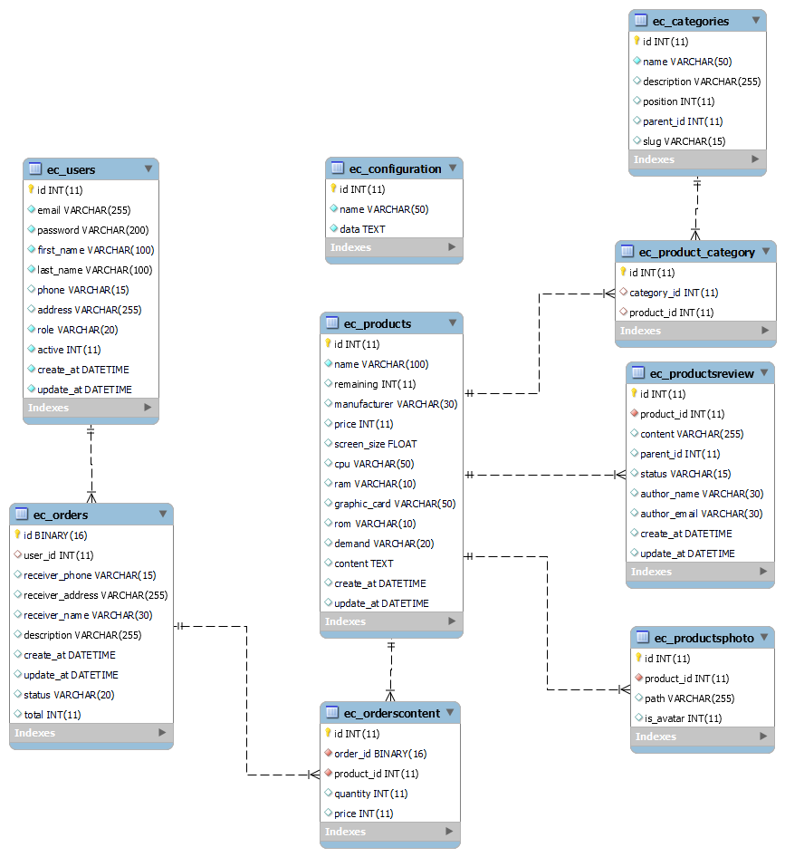

<h1 align="center">Đồ Án Thực Tập 
    Đề tài: ứng dụng mua bán máy tính/Laptop
</h1>

    

# [**Table Of Content**](#table-of-content)
- [**Table Of Content**](#table-of-content)
- [**Topic**](#topic)
- [**Database**](#database)
- [**Important Modules**](#important-modules)
  - [**1. Admin Order Controller**](#1-admin-order-controller)
    - [**1.1. Get Order By Id**](#11-get-order-by-id)
    - [**1.2 - Modify Order**](#12---modify-order)
    - [**1.3. Delete**](#13-delete)
  - [**2. Admin Orders Controller**](#2-admin-orders-controller)
    - [**2.1. Get All**](#21-get-all)
    - [**2.2. Save**](#22-save)
  - [**3. Orders Controller**](#3-orders-controller)
    - [**3.1. Get Latest Order**](#31-get-latest-order)
    - [**3.2. Modify Order**](#32-modify-order)
    - [**3.3. Confirm Order**](#33-confirm-order)
- [**Important Milestones**](#important-milestones)
- [**Performace**](#performace)
- [**Examination**](#examination)
- [**Mentor**](#mentor)
  - [**1. Nguyễn Thị Bích Nguyên**](#1-nguyễn-thị-bích-nguyên)
  - [**2. Nguyễn Anh Hào**](#2-nguyễn-anh-hào)
  - [**3. Lê Hồng Sơn**](#3-lê-hồng-sơn)
  - [**4. Phan Thanh Hy**](#4-phan-thanh-hy)
  - [**6. Lưu Nguyễn Kì Thư**](#6-lưu-nguyễn-kì-thư)
- [**Controller Timeline**](#controller-timeline)
- [**Timeline**](#timeline)
  - [**Phase 1: 29-06-2022 to 10-07-2022**](#phase-1-29-06-2022-to-10-07-2022)
  - [**Phase 2: 10-07-2022 to 13-07-2022**](#phase-2-10-07-2022-to-13-07-2022)
  - [**Phase 3: 14-07-2022 to 22-08-2022**](#phase-3-14-07-2022-to-22-08-2022)
- [**Post Script**](#post-script)
- [**Special Thank**](#special-thank)
- [**Made with 💘 and PHP **](#made-with--and-php-)

# [**Topic**](#topic)

    

<h3 align="center">

***Đề tài thực tập do thầy Nguyễn Anh Hào soạn***
</h3>

# [**Database**](#database)

    

<h3 align="center">

***Bản thiết kế tiêu chuẩn cơ sở dữ liệu cho đồ án thực tập***
</h3>

Các bạn có thể thấy rằng cơ sở dữ liệu này ở mức rất cơ bản, dường như độ phức tạp chỉ ngang bằng với một môn học 
ở trường là hết cỡ 😂. 

Một lý do nữa, có thể coi là nguyên tắc bất thành văn, đồ án thực tập & sau này là đồ án tốt nghiệp phải được triển khai với mô hình **Restful API**.
Các thầy cô sẽ không đồng thuận để chúng ta làm đồ án theo phương thức truyền thống nữa - tức là viết luôn phần xử lý trực tiếp trong sản phẩm đầu cuối luôn( website, application,..)

Lý do cuối cùng là mình làm đồ án này hoàn toàn từ đầu 😎, nên cơ sở dữ càng đơn giản ( nhưng phải đủ yêu cầu đề tài ) thì chức năng sẽ càng ít.

> Note: Trong quá trình làm đồ án mình có hỏi các bạn học của mình thì nhiều đứa lấy luôn đồ án cũ ra để nộp, hầu hết là lấy đồ án từ môn [**Phát triển phần mềm hướng dịch vụ**](https://github.com/Phong-Kaster/PTIT-Phat-Trien-Phan-Mem-Huong-Dich-Vu-Website) & kèm thêm một số chỉnh sửa. Sau đó thì đem nộp 😜

Ở phần tiếp theo, mình sẽ trình bày với các bạn về những module xử lý quan trọng nhất của đồ án này. Những phần khác mình không đề cập vì đơn giản là chúng chỉ là các chức năng thêm - xóa - sửa đơn thuần và không có thuật toán hay chỗ nào xử lý quá phức tạp & để dễ hình dung cái mindset của Phong. 

Tớ sẽ chỉ nói cách xử lý thôi nha, chứ tớ sẽ không chụp code xử lý do có thể các bạn không viết PHP thuần như Phong và mỗi người sẽ có phương án xử lý khác nhau mà, hehe🤧

# [**Important Modules**](#important-modules)

Có 2 controller quan trọng mà có giá trị cao nhất trong đồ án này. Đó là phần xử lý giỏ hàng. 
Xử lý giỏ hàng có lẽ sẽ là phần củ khoai nhất trong đề tài thương mại điện tử.

Hãy chú ý coi qua các controller sau đây: 

## [**1. Admin Order Controller**](#1-admin-order-controller)

Controller này có những chức năng chính như sau: tìm giỏ hàng theo ID, thay đổi nội dung của giỏ hàng & xóa giỏ món hàng trong giỏ hàng

### [**1.1. Get Order By Id**](#11-get-order-by-id)

Tìm kiếm theo Id - chức năng như tên gọi, truyền một ID vào thì sẽ tìm ra giỏ hàng và các món hàng trong giỏ hàng đó. 

### [**1.2 - Modify Order**](#12---modify-order-thay-đổi-nội-dung-giỏ-hàng) 

Tức là thay đổi nội dung giỏ hàng

**Bước 1** - Cần truyền cho controller này: OrderId, Receiver_phone, receiver_address & receiver_phone. Đây sẽ là những trường dữ liệu bắt buộc phải có. 

**Bước 2** - Giỏ hàng chỉ có thể được thay đổi tùy thích trừ khi trạng thái của nó là một trong hai trạng thái sau: delivered & cancel.

**Bước 3**

- Trường hợp 1 - Khi trạng thái giỏ đang là **processing** => **['verified', 'packed', 'being transported', 'delivered' ]** thì số lượng tồn của các sản phẩm sẽ giảm đi tương ứng 
với số lượng có trong giỏ hàng. Tương đương việc người dùng cho sản phẩm vào giỏ hàng và nhấn **Xác nhận** sẽ mua những món hàng này

Ví dụ: Mình mua 3 sản phẩm A và 1 sản phẩm B thì số lượng tồn của nó sẽ bị trừ đi lần lượt là 3 và 2.

Trường hợp mua hàng nhưng có sản phẩm không đủ số lượng thì chương trình sẽ xuất ra thông báo.

> Oops ! Sản phẩm Laptop MSI, Laptop MSi 14 đã hết hàng

- Trường hợp 2 - Khi trạng thái giỏ đang là **["verified", "packed", "being transported"]** => **cancel** thì số lượng 
sản phẩm sẽ được hoàn trả về như cũ. Tức người dùng lựa chọn **Hủy đơn**

Ví dụ: Mình mua 2 sản phẩm A và 2 sản phẩm B, nếu mình hủy giỏ hàng thì số lượng tồn sẽ được cộng lên 2 đơn vị mỗi món hàng.

**Bước 4** - Các quá trình xử lý trên hoàn tất thì sẽ lưu dữ liệu vào cơ sở dữ liệu

### [**1.3. Delete**](#13-delete)

**Bước 1** - Truyền vào OrderID 

**Bước 2** - Nếu giỏ hàng đang ở các trạng thái **["being transported", "deliverd", "verified"]** thì sẽ không cho xóa.

**Bước 3** - Ta chỉ xóa giỏ hàng nếu nó không ở thuộc các trạng thái bước 2 + không có bất kì món hàng trong giỏ hàng này.

**Bước 4** - Lưu các thay đổi vào cơ sở dữ liệu nếu các bước 2 và 3 không bị vi phạm.

## [**2. Admin Orders Controller**](#2-admin-orders-controller)

Controller này phụ trách 2 nhiệm vụ chính hỗ trợ cho người quản trị, gồm: 
getAll() - liệt kê các đơn hàng và save() - tạo mới đơn hàng.

### [**2.1. Get All**](#get-all)

Chức năng này như tên gọi của nó, chỉ đơn thuần liệt kê các thông tin của các đơn hàng trong cơ sở dữ liệu

    

<h3 align="center">

***Dữ liệu trả về liệt kê thông tin các giỏ hàng***
</h3>

### [**2.2. Save**](#save)
Chức năng này giúp người quản trị viên tạo giỏ hàng thay cho khách hàng nếu cần thiết.

**Bước 1** - lấy ra tất cả các dữ liệu từ phía website gửi lên, bao gồm các thông tin cơ bản. Trong số này, 
thông tin người nhận hàng là các dữ liệu bắt buộc phải có - receiver_phone, receiver_name, receiver_address. 

Trong đó, riêng mã đơn hàng(OrderId) sẽ là một UUID - Universally Unique IDentifier - chuỗi có 16 kí tự để tránh trường hợp có 
tin tặc phát hiện ra mã đơn hàng tiếp theo. Dẫn tới chiếm quyền các đơn hàng sau này.

**Bước 2** - vì đây là giỏ hàng nên các thông tin về người nhận hàng cần được kiểm tra kĩ càng. Thông tin người nhận hàng 
phải thỏa mãn các yêu cầu sau: 

- Số điện thoại(receiver_phone) phải có ít nhất 10 số.

- Tên người(receiver_name) chỉ bao gồm chữ cái và các dấu trong tiếng Việt.

- Địa chỉ nhận hàng(receiver_address) chỉ bao gồm chữ cái, các dấu trong tiếng việt, khoảng trắng & dấu phẩy.

**Bước 3** - Kiểm tra trạng thái của đơn hàng có hợp lệ hay là không. Một đơn hàng sẽ có 6 trạng thái sau là hợp lệ: 

- Processing - tức đang xử lý, người dùng và quản trị viên vẫn đang mua và vẫn có thể thay đổi nội dung giỏ hàng.

- Verified - tức người dùng xác nhận mua hàng hoặc người quản trị viên xác nhận giúp người dùng qua điện thoại rằng họ sẽ mua hàng. 

- Packed - tức đơn hàng đã đóng gói.

- Being transported - tức đơn hàng đang vận chuyển

- Delivered - tức đơn hàng đã vận chuyển thành công tới người dùng.

- Cancel - tức đơn hàng bị hủy bởi người dùng hoặc quản trị viên

**Bước 4** - nếu các bước xử lý ở bên trên là hợp lệ thì tiến hành tạo mới đơn hàng.

    

<h3 align="center">

***Dữ liệu trả về nếu giỏ hàng được tạo thành công***
</h3>

## [**3. Orders Controller**](#3-orders-controller)

Đây là chức năng xử lý giỏ hàng cho phía khách hàng. Có 3 hàm chính trong Controller này bao gồm 

1. Get Latest Order - lấy ra giỏ hàng gần nhất của người dùng mà trạng thái là Processing.

2. Modify Order - cập nhật lại các món hàng trong giỏ hàng của người dùng 

3. Confirm Order - xử lý khi người dùng ấn nút **XÁC NHẬN** mua hàng. Chức năng này liên quan đến xử lý 
số lượng hàng tồn kho hay nói cách khác là xử lý tranh chấp.

### [**3.1. Get Latest Order**](#31-get-latest-order)

Lấy ra giỏ hàng gần nhất của người dùng mà trạng thái là processing. Nếu có giỏ hàng tồn tại thì tiếp tục cho người 
dùng chỉnh sửa nội dung các món hàng trong giỏ hàng này.

    

<h3 align="center">

***Giỏ hàng được tạo mới thì msg là Latest order is picked up successfully***
</h3>

Nếu không có giỏ hàng nào tồn tại thì tạo mới cho người dùng.

    

<h3 align="center">

***Giỏ hàng được tạo mới thì msg là Order is created successfully***
</h3>

### [**3.2. Modify Order**](#32-modify-order)

Chức này này cập nhật lại các món hàng trong giỏ hàng của người dùng.

Luồng xử lý chính sẽ như sau:

**Bước nhận và kiểm thử** - kiểm tra tính đúng sai của dữ liệu nhận vào. Ví dụ: có đơn hàng nào với mã đơn nhận được không ? Có món hàng nào với ID đó hay không ?

**Bước xử lý** - sẽ có 3 trường hợp xảy ra khi chỉnh sửa một đơn hàng như sau 

- Có món hàng(product_id) trong giỏ hàng nhưng người dùng cập nhật số lượng của nó về 0 => xóa món hàng này khỏi giỏ hàng.

- Có món hàng(product_id) trong giỏ hàng nhưng số lượng bị thay đổi và số lượng này khác 0 => tiến hành cập nhật lại.

- Không có món hàng(product_id) trong giỏ hàng => tiến hành tạo mới một order content với product_id và order_id đó.

### [**3.3. Confirm Order**](#33-confirm-order)

Chức năng này sinh ra để xử lý tranh chấp khi người dùng xác nhận mua món hàng. Có thể hiểu đơn giản như sau, khi người dùng chọn 3 món hàng 
A, B và C cho vào giỏ hàng. Số lượng họ chọn mua các mặt hàng là không bị giới hạn.

Tuy nhiên, khi họ quyết định mua và nhấn **XÁC NHẬN** mua hàng. Hệ thống sẽ tiến hành kiểm tra số lượng tồn với số lượng họ mua. Điều này sẽ dẫn tới 4 kết quả 
như sau:

**Trường hợp 1** - số lượng tồn của món hàng(product_id) lớn hơn số lượng người dùng mua thì tiến hành trừ đi số lượng tương ứng. Ví dụ: số lượng 
tồn là 10, người dùng mua 2 thì số lượng tồn còn lại là 8.

**Trường hợp 2** - số lượng tồn của món hàng(product_id) nhỏ hơn số lượng người dùng mua thì lúc này sẽ xuất ra thông báo để người dùng biết và thay đổi 

**Trường hợp 3** - người dùng mua 3 món hàng thì A có số lượng tồn đáp ứng nhưng số lượng tồn của B và C thì đã hết => Xuất ra thông báo rằng B và C đã hết hàng và dừng lại luôn

**Trường hợp 4** - người dùng đã **XÁC NHẬN** mua hàng nhưng sau đó thay đổi suy nghĩ và chọn **HỦY ĐƠN HÀNG** thì số lượng tồn của các món hàng sẽ được hoàn trả lại. 
Ví dụ: người dùng mua món hàng A với số lượng 2 món và sau đó nhấn hủy đơn thì số lượng tồn của món hàng A sẽ tăng lên 2 đơn vị.

# [**Important Milestones**](#important-milestone)

Trước khi đi vào những chia sẻ của mình lúc làm đồ án thực tập thì các bạn cần lắm được một số các mốc thời gian quan trọng sau:

**Ngày 20-5** - đăng ký thông tin cá nhân, đơn vị thực tập và đề tài thực tập 

Theo thông báo của nhà trường thì ngày này là ngày sẽ chốt thông tin nhưng **không phải đâu nha**. Sau ngày này, kể các bạn để trống 
chưa đăng ký thông tin vẫn không sao đâu nha. Lúc này cứ điền bừa thông tin đơn vị thực tập cũng được

**Ngày 15-06 đến 24-06** - đăng ký học hè và chốt danh sách thông tin thực tập 

**Ngày 29-06** - sinh viên nhận đề tài và bắt tay vào làm đồ án thực tập

**Sau ngày 29-06** - sinh viên nào đổi đơn vị thực tập thì liên hệ riêng với giáo viên hướng dẫn 

**Ngày 31-08 đến 06-09** - kết thúc đồ án và chuẩn bị quá trình chấm điểm đồ án thực tập

Vậy là các bạn sẽ có khoảng 2 tháng để làm đồ án thực tập từ cuối tháng 6 đến hết tháng 8

> Note: mốc thời gian trên là đối với khóa D18 của Phong. Các bạn ở tương lai đọc có thể sẽ khác đi một chút.
Du di đi với ngày so với lịch của mình🦁

# [**Performace**](#performace)

Okay, qua mấy phần trình bày ở trên các bạn đã hiểu ý tưởng mình thực hiện rồi. Giờ mình sẽ đến với việc thực hiện như thế nào nha !

Sau khi đề tài được nhà trường chính thức xác nhận thì chúng ta sẽ bắt đầu làm đồ án thực tập. Ở thời điểm này, sinh viên chúng ta
hầu hết đều đã đi thực tập nên thời gian làm đồ án rất hạn chết. Ví dụ như Phong khi thực tập tại công ty Geocomply thì thời gian làm việc hành chính sẽ
bắt đầu từ 9h sáng đến 6h tối thì về nhà. Kèm theo thời gian di chuyển + thời gian nghỉ ngơi thì thông thường mình sẽ bắt đầu làm đồ án từ lúc 8h tối đến 12h đêm & ngày nào 
cũng làm đều như vắt chanh 🍋

Trong thời gian tương đối "nếm mật nằm gai" này thì tùy vào sự nỗ lực của mỗi cá nhân mà chất lượng đồ án sẽ khác nhau. Ai quyết tâm thì thường đồ án rất chất lượng. Ngược 
lại, mấy bạn mải đi làm thì hầu như đồ án khá là kém chất lượng, thậm chí là có bạn bỏ luôn và không làm đồ án nữa( coi như bỏ phí 4 năm rưỡi đèn sách và cái bằng đại học 😘). 

Thông thường, hàng tuần sinh viên sẽ phải báo cáo tiến độ cho giáo viên hướng dẫn. Tùy từng thầy cô mà hình thức báo cáo là khác nhau:

- Với mình, giáo viên hướng dẫn là thầy Nguyễn Anh Hào thì sẽ báo cáo tiến độ bằng cách viết word và hoàn toàn phải tự giác.

- Với các giáo viên khác, theo mình nghe từ bạn bè thì thường là báo cáo online. Còn bắt buộc tham gia hay không thì phải tùy vào giáo viên. 

Ngoài ra, sẽ có 2 lần các bạn phải viết báo cáo tiến độ định kì & nộp cho nhà trường nữa. Hai lần báo cáo định kì này vô cùng quan trọng vì
chúng sẽ ảnh hưởng rất nhiều tới điểm đồ án thực tập từ giáo viên hướng dẫn.👨‍🎓👨‍🎓👨‍🎓

Phần [**Mentor**](#mentor) mình sẽ nói rõ hơn về từng giáo viên mà mình biết.

# [**Examination**](#examination)

Phần này mình sẽ nói về hình thức thi cử đồ án. Sau khi hết thời hạn làm đồ án. Các giáo viên hướng dẫn sẽ lên danh sách các 
sinh viên mà mình quản lý và gửi về nhà trường để sắp xếp lịch chấm thi. Thông thường, thời gian để thi đồ án thực tập là khoảng 2 tuần lễ.

Đồ án thực tập sẽ trải qua 2 vòng loại. Cả 2 vòng loại này đều là thi online qua Google meeting chứ không phải lên trường.

Để dễ hình dung mình sẽ định danh lần lượt là **vòng sơ khảo** và **vòng phúc khảo**

- Vòng sơ khảo: bạn và giáo viên hướng dẫn sẽ thi vấn đáp 1 vs 1 với nhau. Thường diễn ra trong 30-45 phút. Ở vòng này, giáo viên hướng dẫn sẽ đặt câu hỏi 
và đánh giá chất lượng đồ án. Dĩ nhiên rồi! Có chấm điểm nha💯 nhưng mình sẽ không biết điểm đâu 

- Vòng phúc khảo: bạn sẽ được sắp xếp để vấn đáp thêm với một giáo viên phản biện khác. Thời gian diễn ra vòng này là sau 1 tuần từ vòng sơ khảo. 
Cũng vẫn đáp như trên luôn🥱. 

Giáo viên chấm cho mình là thầy **Lê Minh Hóa** - trưởng khoa Công nghệ đa phương tiện - nếu bạn học qua thầy thì sẽ 
nhớ thầy này là người rất hài hước và dễ tính. Điều đó đúng tới lúc chấm thi. 
Thầy chấm rất nhẹ nhàng, chỉ hỏi một số câu hỏi mang tính thủ tục và cho 
qua.(Lúc mình thi, ổng coi mới 3 đứa xong ổng kêu là "chấm thi các bạn thầy nhức đầu quá, cho 
thầy nghỉ 30 phút uống thuốc nha các em 🤣😂😂")

Sau khi kết thúc 2 vòng trên thì chúng ta đã được coi như chính thức thoát áp lực trong khoảng gần 2 tháng vừa qua🎇🎇. Yeah, đi xõa thôi. Và chờ kết quả thi,
điểm cho đồ án sẽ lấy điểm của giáo viên hướng dẫn + giáo viên phản biện và chia đôi.

Sau khi có điểm đồ án thực tập. Sẽ đến giai đoạn phân loại ai được làm đồ án tốt nghiệp và ai phải học 2 môn thay thế để ra trường.

Có 2 yếu tố để nhà trường cho các bạn làm đồ án tốt nghiệp 

1. Điểm đồ án thực tập của sinh viên 

2. Điểm thành tích học tập của sinh viên trong suốt 4 năm học tại trường. Tớ xin trích lời bạn lớp trưởng lớp tớ - D18CQCP02 - Huỳnh Phước Sang để các bạn dễ nắm bắt 

> A: Có giới hạn số người được làm đồ án ko á Phước Sang hay đủ điểm là đc làm á ông

> B: Nghe bảo là bốc từ trên xuống tới tầm bao nhiêu người ấy. Hằng năm thường là 2.7

> Sang: Có ông nha, lấy từ trên xuống, dao động khoảng từ 60-70 người hằng năm, đa phần sau khi xét như vậy thì các năm điểm thường 
dao động từ 2.7-2.8 đổ lên. Trong trường hợp lấy người mà chưa đủ số lượng nhưng điểm thấp 
quá(ví dụ lấy khoảng 50 bạn mà điểm đã tới khoảng 2.5) thì đôi khi sẽ ngưng lại không xét nữa- tức làm đồ án chỉ khoảng 50 người thôi ông

# [**Mentor**](#mentor)

Vài dòng mình để đây không có chủ đích xúc phạm giáo viên nào nhưng mình bức xúc quá nên đánh phá luật vậy

## [**1. Nguyễn Thị Bích Nguyên**](#nguyen-thi-bich-nguyen)

Nói thẳng luôn nhé ! Bạn nào mà trúng cô hướng dẫn làm đồ án thì cứ phải gọi là đen vãi cả l*n. Vì mình là người bị phân trúng vào cô Nguyên nên mình cực khó chịu vì lý do sau: Thông thường, 
một giáo viên hướng dẫn sẽ chủ động liên hệ với bạn để giao đề tài tốt nghiệp và chỉnh sửa thông tin các kiểu.
Nhưng cô Nguyên thì lại ở cái thể loại hãm l*l hơn, cô éo bao giờ chủ động liên lạc với các bạn đâu nhé.

Nói chung là nằm mơ cũng chưa chắc 🙂☺ cô đã liên lạc với bạn. Lúc nhà trường công cố danh sách giáo viên 
hướng dẫn đồ án thực tập, mình đã muốn đổi ngay khi biết người hướng dẫn mình là cô Nguyên do từ khi
mình học năm 2 - 3, mình đã nghe các anh chị kể về cô Nguyên với một tâm trạng **ÚI GIỜI ƠI** rùi.

Và quả nhiên là đúng cmn luôn. Mình chủ động liên lạc với cô từ lúc danh sách công bố tới gần sát ngày chốt sổ để 
công bố danh sách chính thức. Liên lạc với cô qua e-mail, số điện thoại, Zalo, Facebook,.... (nói chung là hết
tất cả các phương thức mà các bạn có thể nghĩ ra 😫). Gỉa sử, số phone nhà trường cung cấp trong e-mail tới sinh
viên chẳng hạn, gọi 10 cuộc thì cả 10 cuộc toàn... thuê bao.

Một điều hãi hùng nữa là cô Nguyên có đam mê họp lúc 1-2h sáng. Trong khi thời điểm này, các bạn sinh viên 
đi thực tập về đã mỏi mệt lắm rùi + cố gắng làm đồ án thực tập nữa. Theo mình nghe ngóng thì hầu 
như họp với cô xong chả giải quyết vấn đề gì, chỉ có sự áp lực từ việc bị chửi mắng là tăng lên rõ rệt 😡😡.

## [**2. Nguyễn Anh Hào**](#nguyen-anh-hao)

Người thầy chọn mặt gửi vàng của Phong.

Do trúng cô Nguyên nên thực sự là mình không muốn đề người hướng dẫn là cô Nguyên. Qua sự tư vấn từ bạn `Huỳnh Phước Sang` nên mình quyết tâm liên 
lạc với thầy để nhận được sự giúp đỡ từ thầy.

Thật may mắn là sự nỗ lực đã được đền đáp xứng đáng. Thầy Hào cho đã chấp nhận sẽ hướng dẫn cho mình và đồng ý với đề tài mà mình tự 
chọn tại nơi thực tập thay vì phải làm đề tài của thầy soạn.

Từ lúc nhận đề tài(ngày 29-06-2022) tới khi viết những dòng lưu bút này(10-07-2022) thầy vẫn chưa có hồi âm gì về hướng dẫn cả. Có lẽ do thầy bận hoặc 
thầy muốn để sinh viên tự làm đúng hay không ? Mình cũng không biết nữa.

**18-09-2022**

Thế là xong đồ án thực tập. Làm đồ án thực tập với thầy Hào sẽ chia ra làm 2 ý kiến: "Thầy Hào khó lắm" & "Thầy Hào dễ lắm"

Với mình thì thầy Hào rất dễ. Thầy Hào kĩ tính nhưng không khắt khe như thầy Thư. Có thể nói là ở mức cân bằng giữa sự theo sát kèm cặp và sự khắt khe.
Khi làm đồ án với thầy Hào thì hàng tuần chúng ta sẽ phải tự giác viết báo cáo tiến độ hàng tuần với thầy. Sự thật thì 
chính quá trình báo cáo tiến độ hàng tuần này là cách để thầy Hào đánh giá và phân loại xem chúng ta có được thi đồ án thực tập hay là không? Chỉ 
cần mỗi tuần các bạn viết báo cáo tiến độ đều đặn và cẩn thận một chút là sẽ tạo được thiện cảm cho thầy Hào. 

Với những sinh viên kêu thầy khó là do tụi này không có ý thực tự giác và không thực sự đầu tư thời gian làm đồ án nên 
thầy Hào thường chấm tụi này cực kì khắc khe. 
Thường thì đứa làm kém sẽ không nộp báo cáo tiến độ hàng tuần nên sẽ được thầy đưa vào danh sách đen. 

**Hầu hết các trường hợp bị thầy Hào đánh rớt là do không nộp báo cáo tiến độ hàng tuần đều đặn**

> Note: Chỉ có nhược điểm là nếu các bạn cần trợ giúp hoặc xin ý kiến thầy qua e-mail thì thầy trả lời tin nhắn khá là chậm chạp.

## [**3. Lê Hồng Sơn**](#le-hong-son)

Là giám đốc của Học viện mình. Đứng ở cương vị là người quản lý cấp cao nhất của nhà trường, ông thầy 
này ra rất nhiều yêu cầu nhưng cực kì mơ hồ, mông lung. Nếu bạn muốn làm đồ án cẩn thận thì nên né ông này luôn 

## [**4. Phan Thanh Hy**](#phan-thanh-hy)

Dĩ nhiên, mình không làm đồ án dưới sự hướng dẫn của thầy. Nhưng tiếng lành đồn xa😝😝, là `người hướng dẫn đồ án 
tào lao bí đao nhất Học viện` nên hàng năm có cực kì nhiều sinh viên liên hệ với thầy để hướng 
dẫn làm đồ án thực tập. Tại do `tào lao bí đao` quá nên thầy này chấm đồ án thực tập rất dễ. 

Mình khuyến khích bạn nào học yếu nên liên hệ trước với thầy luôn để ra trường sẽ dễ thở hơn.

Tuy nhiên, phía trên là mình được nghe kể chứ sự thực thì không phải như vầy🙅‍♂️🙅‍♀️

Ông thầy này rất là **TÀO LAO** theo đúng nghĩa đen và nghĩa bóng. Vì bạn mình làm đồ án với ông thầy này nên mình có thể tường thuật lại 
chi tiết như sau:
- Thứ nhất, thầy này không theo sát & kèm cặp đồ án như các thầy cô khác. Có thể nói là không hề quan tâm một tí gì tới sinh viên luôn 😀
- Thứ hai, đề tài giao ra cực kì mông lung, không bám sát chuyên môn của sinh viên. Ví dụ bạn học công nghệ phần mềm nhưng ổng cho bạn làm đề tài 
liên quan tới mạng máy tính hoặc AI các kiểu.
- Thứ ba, đánh rớt sinh viên với những lý do rất tào lao. Trong khóa của mình, có 2 trường hợp bị đánh rớt đồ án thực tập vì những lý do vớ vẩn như này nè:

**Trường hợp 1** - đánh rớt vì căn lề không chính xác trong báo cáo thực tập

**Trường hợp 2** - viết báo cáo thực tập nhiều hơn 6 chương thì cũng rớt 

Hai trường hợp này ổng cho ăn con ngỗng to đùng. Điều này đồng nghĩa với việc 2 bạn này sẽ phải chờ tới sang năm để học lại. Dĩ nhiên là ra trường muộn rồi😀😀

Tuy nhiên, nếu như vậy thì hàng năm sẽ không có nhiều sinh viên liên hệ để ông này làm giáo viên thực tập. Chính cái sự **TÀO LAO** phía trên cũng là điểm 
thu hút sinh viên tới với ông thầy này. Mình sẽ mách nước các bạn 2 điều như sau:

**Điều 1** - dù ai nói ngả ngả nói nghiêng. Lòng ta vẫn vững như kiềng ba chân. Tức là hàng năm số lượng sinh viên làm đề tài bán hàng/thương 
mại điện tử là rất nhiều. Ông thầy sẽ chốt câu "Lại bán hàng à, em có thể làm cái gì mới hơn không". Nhiều đứa nghe câu này tinh thần không vững và 
chọn làm những đề tài do ông này đưa ra như mạng máy tính, Socket, AI các kiểu nên dẫn tới kết quả không cao và bị thấp điểm => Nếu bạn muốn làm đề tài nào 
thì cứ tự tin chọn đề tài đó mà làm( giáo viên cũng phải lắng nghe sinh viên muốn làm đề tài nào chứ không thể tự ý cho bừa đề tài được)

**Điều 2** - làm đồ án thực tập và viết báo cáo chịu khó cẩn thận 1 chút xíu thôi là sẽ được 9-10 điểm ngay. Ông thầy này chấm điểm thực tập cho sinh viên 
của mình rất hào phóng😏🙄. Chăm chút một xíu là được.

## [**6. Lưu Nguyễn Kì Thư**](#luu-nguyen-ki-thu)

Giảng viên huyền thoại của trường PTIT. Người đã góp phần tạo nên bao nỗi ác mộng cho các thế hệ sinh viên Học viện. Tuy nhiên,
nếu bạn nào muốn có 1 người thấy chi tiết, hỗ trợ nhiệt tình tới tận răng thì nên chọn thầy. 

Lưu ý duy nhất là hãy suy nghĩ xem bạn học có đủ khá | giỏi không ? Vì thầy tuy chi tiết nhưng ra đề tài làm đồ án thực tập cũng tương đối phức tạp & chấm rất gắt 😨😨

Từ các bạn học của mình thì thầy Thư được đánh giá là "tốt, theo sát và kèm cặp sinh viên rất chu đáo". 

Tuy nhiên, đề tài thường do ông thầy giao chứ sinh viên không được tự chọn như các giáo viên khác. Thường đề tài 
ông Thư giao thường khó hơn so với yêu cầu của các giáo viên khác

Với ông Thư thì mỗi cuối tuần, tất cả các sinh viên bắt buộc phải tham gia báo cáo online qua Google meet cho ông thầy.
Nếu như vắng mặt thì phải có lý do chính đánh.

Mỗi tuần, ông thầy sẽ giao các yêu cầu mà sinh viên phải hoàn thành trong tuần đó. Nếu tới buổi báo cáo mà chưa hoàn thiện thì ông thầy có thể 
cho bạn nợ lại nhưng bạn sẽ phải hoàn thành trước buổi báo cáo tiến độ tuần tới. Ví dụ, thứ 5 tuần tới bạn phải báo cáo
cho ông thầy chẳng hạn.😱😰

# [**Controller Timeline**](#controller-timeline)

Trình tự xây dựng các controller của đồ án này, cái này các bạn tham khảo để nhận biết cái controller nào sẽ `ưu tiên xây dựng trước`.

> Note: quy ước ở cái số 3 và 4 áp dụng cho tất cả Controller nào có dạng số ít và số nhiều như `3` và `4`

> Note: các controller có tiền tố Admin ở đầu. Ví dụ: AdminProductsController, AdminCategoryController,.. là thuộc về quản trị viên. Những cái không có tiền tố ở đầu là của khách hàng

1. Login Controller

2. Sign Up Controller

3. Admin Users Controller - cái này để lấy danh sách toàn bộ user ngoại trừ chính người đang đăng nhập và thêm mới một user

4. Admin User Controller - các chức năng sửa-xóa-lấy thông tin 1 user.

5. Admin Product Controller 

6. Admin Product Controller

7. Admin Products Photos Controller - lấy ra danh sách ảnh theo ID và upload ảnh cho một sản phẩm

8. Admin Orders Controller

9. Admin Order Controller

10. Admin Orders Content Controller

11. Admin Reviews Controller

12. Products Controller 

13. Product Controller

14. Orders Controller - lấy ra giỏ hàng mới nhất chưa thanh toán & tùy biến nội dung của giỏ hàng.

15. Profile Controller - lấy ra thông tin tài khoản bằng access Token.

16. Category Controller - lấy ra các Product thuộc một danh mục

17. Categories Controller - lấy ra các danh mục và các thông tin liên quan của một danh mục

18. Order Controller - sửa đổi thông tin người nhận hàng

19. Auth With Google Controller - tạo tài khoản bằng Google

# [**Timeline**](#timeline)

## [**Phase 1: 29-06-2022 to 10-07-2022**](#phase-1-29-06-2022-to-10-07-2022)

> Ý nghĩa: Giai đoạn này phát triển API cho phía người quản trị viên.

- **29-06-2022** - khởi tạo dự án, chức năng đăng nhập và tạo mã JWT token

- **30-06-2022** - sửa lỗi JWT token do mã hóa sai, thêm Product & Products Model

- **02-07-2022** 
  
1. C.R.U.D cho bảng `Users`
2. Thêm model ProductCategories | ProductCategory | ProductsPhoto | ProductsPhotos
3. Tạo ProductsController & chức năng truy vấn dữ liệu có bộ lọc nâng cao( Không khó nhưng lâu vãi *beep* 😖)

- **03-07-2022**
1. Sửa lỗi truy vấn trong ProductsController getAll()
2. Create cho ProductsController()

- **04-07-2022**
1. R.U.D cho ProductController
2. Thêm model OrdersContent | OrdersContents Model
3. Upload ảnh cho sản phẩm
   
- **05-07-2022**
1. U.D cho sản phẩm 
2. Tinh chỉnh lại upload ảnh cho sản phẩm
3. Create cho AdminOrdersController()

- **06-07-2022**
1. C.R.U.D cho AdminOrders | Admin Order controller

- **07-07-2022**
1. Admin Orders Content Controller với đọc nội dung đơn hàng và cập nhật số lượng sản phẩm trong đơn hàng - chức năng gì 
mà loằng ngoằng quá 😴🥱. Mất mịa cả buổi tối rùi

- **09-07-2022**
1. Hoàn thiện các tính năng cập nhật, thay đổi thông tin của một đơn hàng
2. Liệt kê toàn bộ bình luận & thêm mới bình luận ở vai trò Admin

- **10-07-2022**
1. Xong toàn bộ tính năng quản lý bình luận

## [**Phase 2: 10-07-2022 to 13-07-2022**](#phase-2-10-07-2022-to-13-07-2022)

> Ý nghĩa: Giai đoạn này phát triển API cho phía người người dùng.

- **10-07-2022**
1. Products Controller - lấy danh sách sản phẩm 
2. Product Controller - chi tiết 1 sản phẩm theo ID truyền vào

- **11-07-2022**
1. Orders Controller - lấy ra giỏ hàng cho người sử dụng và thay đổi nội dung trong giỏ hàng

- **12-07-2022**
1. Tinh chỉnh lại cách xử lý giỏ hàng ở phía người dùng. Nếu không có đủ hàng sẽ không cho đơn hàng đó
tiếp tục

- **13-07-2022**
1. Tinh chỉnh lại cách xử lý giỏ hàng ở phía người quản trị. Nếu không đủ hàng sẽ không cho đơn hàng đó
tiếp tục
2. Tối ưu hóa quy trình kiểm tra dữ liệu đầu vào cho Sign Up Controller với bộ lọc cho firt_name và last_name.

## [**Phase 3: 14-07-2022 to 22-08-2022**](#phase-3-14-07-2022-to-22-08-2022)

- **14-07-2022**
1. Dựng thư mục đồ án Android
2. Hoàn thành màn hình đăng nhập và hiệu ứng loading screen

- **16-07-2022**
1. Thêm Profile Controller để lấy ra thông tin người dùng
2. Màn hình intro, đăng nhập cho Android

- **17-07-2022**
1. Hoàn thiện trang chủ ứng dụng Android
2. Hoàn thiện màn hình kết quả tìm kiếm

- **18-07-2022**
1. Xong các thao tác tìm kiếm bằng SearchView và chọn theo nhu cầu ở trang chủ
2. Phác họa xong màn hình giao diện bộ lọc sản phẩm.

- **19-07-2022**
1. Xong xử lý logic cho màn hình giao diện bộ lọc sản phẩm
2. Dựng khung hình màn hình chi tiết sản phẩm

- **20-07-2022**
1. Chinh sửa lại cách trả về đường dẫn hình ảnh của getProductById()
2. Xong màn hình thông tin sản phẩm

- **21-07-2022**
1. Modal Bottom Sheet để chọn số lượng sản phẩm 
2. Lấy được API liên quan tới giỏ hàng gần nhất

- **22-07-2022**
1. Nằm đáp chăn + bật quạt
   
- **23-07-2022**
1. Xong chức năng Thêm vào giỏ hàng.
2. Dựng khung màn hình Danh mục

- **24-07-2022**
1. Hoàn thiện màn hình danh mục
2. Xóa nút trở về và giỏ hàng ở màn hình chi tiết sản phẩm

- **25-07-2022**
1. Dựng xong màn hình giỏ hàng và đổ dữ liệu vào.

- **26-07-2022**
1. Viết báo cáo thực tập cho thầy Hào - lần 1.
2. Xử lý khi người dùng cập nhật số lượng sản phẩm thì tổng số tiền cũng thay đổi theo. (Không khó mà làm lâu vãi beep)

- **27-07-2022**
1. Xử lý đồng bộ số lượng sản phẩm với tổng đơn giá.
2. Dựng màn hình thanh toán & đổ 1 nửa dữ liệu vào.

- **28-07-2022**
1. Tạo Order controller để cho phép người dùng sửa thông tin người nhận.
2. Dựng màn hình sửa thông tin người nhận và api gửi nhận thông tin.

- **29-07-2022**
1. Tinh chỉnh các sự kiện để khi nhấn giỏ hàng thì giỏ hàng tự động làm mới lại
2. Thêm màn hình xác nhận đặt hàng thành công 
3. Dựng màn hình cá nhân và các cài đặt quan trọng.

- **30-07-2022**
1. Viết báo cáo định kì lần 1 cho nhà trường 
2. Viết báo cáo hàng tuần cho thầy Hào

- **31-07-2022**
1. Thêm chức năng tìm kiếm order bằng ID cho phía khách hàng 
2. Tái tổ chức các chức năng trong order và orders để dễ đọc hơn
3. Xong màn hình xem toàn bộ các giỏ hàng và xem chi tiết đơn hàng Android
4. Tách riêng biệt việc lấy danh sách đơn hàng ra khỏi lấy một đơn hàng mới nhất 

- **01-08-2022**
1. Xong màn hình đăng kí tài khoản với email và mật khẩu
2. Tìm hiểu lý thuyết về Oath 2.0

- **02-08-2022**
1. Làm báo cáo thực tập định kì 1

- **03-08-2022**
1. Nộp báo cáo thực tập lần 1
2. Thiết kế nút đăng nhập với Google cho Android
3. Tạo controller Auth With Google để tạo tài khoản bằng Google 

- **04-08-2022**
1. Hoàn thiện tính năng đăng nhập bằng tài khoản Google cho cả API & Android
2. Nút mua ngay trong Android

- **05-08-2022**

- **06-08-2022**
1. Xong tính năng chỉnh sửa thông tin cá nhân

- **07-08-2022**
1. Admin - Thiết kế màn hình quản lý danh sách đơn hàng
2. Admin - Nút xóa đơn nếu đơn hàng đó rỗng 

- **08-08-2022**
1. Admin - Thiết kế màn hình sửa thông tin của đơn hàng.
2. Admin - Xong chức năng sửa thông tin đơn hàng - lâu vl

- **09-08-2022**
1. Admin - Dựng màn hình thay đổi nội dung đơn hàng 
2. Admin - Viết ViewModel + Repository cho chức năng thay đổi nội dung đơn hàng
3. Admin - Thay đổi nội dung của giỏ hàng - bao gồm thay đổi số lượng - xóa - thêm mới sản phẩm vào giỏ hàng

- **10-09-2022**
1. Admin - Thêm mới một đơn hàng

- **11-08-2022**
1. Admin - màn hình quản lý danh sách sản phẩm

- **12-08-2022**
1. Nằm đắp chăn bật quạt

- **13-08-2022**
1. Admin - Dựng màn hình tìm kiếm sản phẩm nâng cao

- **14-08-2022**
1. Admin - Sửa chi tiết sản phẩm
2. Admin - Thêm mới sản phẩm

- **15-08-2022**
1. Viết báo cáo thực tập lần 2 - Tạm biệt em, cô gái mà tôi chưa kịp nói lời yêu

- **16-08-2022**
1. Hoàn thiện báo cáo thực tập lần 2

- **17-08-2022**
1. Hoàn thiện báo cáo thực tập lần 2 & nộp 

- **18-08-2022**
1. Thêm nút hủy đơn hàng cho giỏ hàng của phía người dùng

- **19-08-2022**
1. Đi party tại công ty, say sml 😵

- **20-08-2022**
1. Thiết kế danh sách hình ảnh sản phẩm 
2. Nút xóa một ảnh sản phẩm
3. Nút cài một hình làm mặc định

- **21-08-2022**
1. Làm tính năng upload ảnh nhưng chưa xong.

- **22-08-2022**
1. Hoàn thiện tính năng upload ảnh cho sản phẩm, chính thức hoàn thiện đồ án thực tập.

# [**Post Script**](#post-script)

[**11h41 PM Tuesday, 05-07-2022**](#)

Cả tối mới làm được 2 chức năng ảnh cho sản phẩm. Lo quá 😥 còn phía người dùng nữa. Sợ thực sự.

[**11:58 PM Thursday, 08-07-2022**](#)

Sài gòn hôm nay mưa to quá ☔. Đi làm về muộn mệt ghê. Thêm quả chứ năng chỉnh sửa nội dung đơn hàng cồng kềnh thật sự. 

[**12:11 AM Thursday, 10-07-2022**](#)

Nửa đêm rồi, sài gòn lại mưa thật hối hả ⛈. Phần API gần xong rùi, cháy hết mình nào 🔥. Chào chiến thắng ✌

À mai thứ 6 rồi 😍😍😎😎. Sắp tới ngày cuối tuần rùi😘😍. Mong thứ 6 qua thật nhanh

[**12:49 PM Tuesday, 12-07-2022**](#)

Buồn ngủ quá 😪. Cái giỏ hàng coi vậy mà phức tạp ra phết ấy chứ bộ !. Hên là đã xong được phía người dùng rồi.
Còn phía quản trị viên chưa làm. 

[**09:54 PM Sunday, 24-07-2022**](#)

Nay ngủ cả buổi chiều mà sao giờ đã buồn ngủ thế nhỉ ? Thui kệ tới sao thì tới.

[**12:13 PM Tuesday, 26-07-2022**](#)

Dựng xong màn hình giỏ hàng là thấy vui rồi 🤣🤣🤣. Phần Android đã xong được 3/4 chặng đường, chỉ còn màn hình cài đặt nữa là xong.
Thui đi ngủ mai viết báo cáo cho thầy.

[**11:34 PM Wednesday, 27-07-2022**](#)

Hi vọng đến hết tuần này thì sẽ xong được hết Android. Mỏi mệt quá rồi 😥

[**11:24 PM Thursday, 28-07-2022**](#)

Tự dưng tụt cảm xúc quá 😅. Không muốn làm nữa

[**11:59 PM Friday, 29-07-2022**](#)

95% rồi 🔥. Còn một chút nữa thôi. 

[**10:23 PM Sunday, 21-08-2022**](#)

5% cuối cùng coi bộ hơi bị khó ><

[**11:18 PM Sunday, 22-08-2022**](#)

Chính thức chấm dứt chuỗi ngày dài nếm mật nằm gai với đồ án. Cuối cùng đồ án cũng đã hoàn tất.

[**11:17 PM Friday, 02-09-2022**](#)

Mai bắt đầu báo cáo đồ án thực tập rồi 🤔. Căng quá ta! Vừa sửa xong vài lỗi vặt cho an tâm

# [**Special Thank**](#our-team)

<table>
        <tr>
            <td align="center">
                <a href="https://github.com/ngdanghau">
                    
                     
                    <b>Nguyễn Đăng Hậu</b>
                </a>
            </td>
            <td align="center">
                <a href="https://github.com/Phong-Kaster">
                    
                     
                    <b>Nguyễn Thành Phong</b>
                </a>
            </td>
        </tr>    
</table>
 
# [**Made with 💘 and PHP **](#made-with-love-and-php)